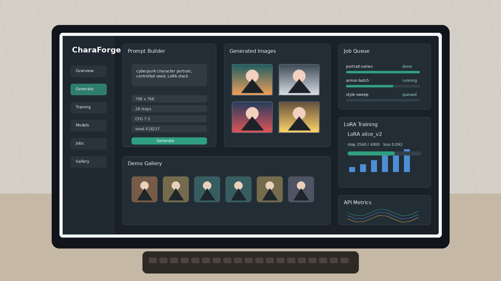
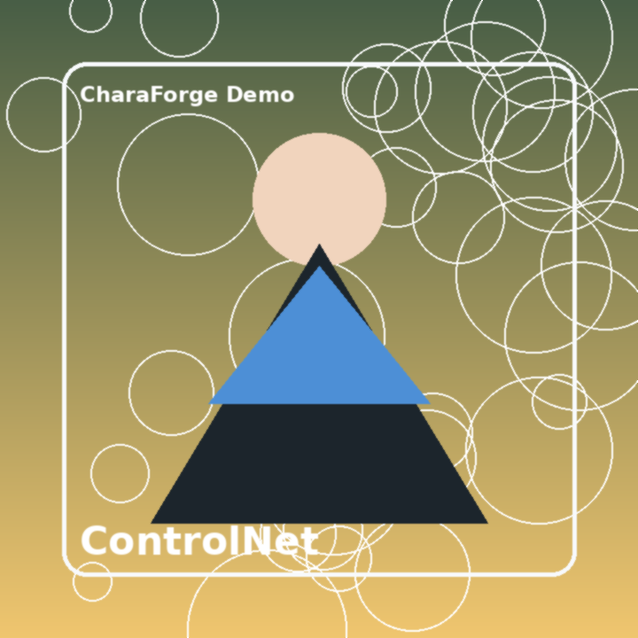
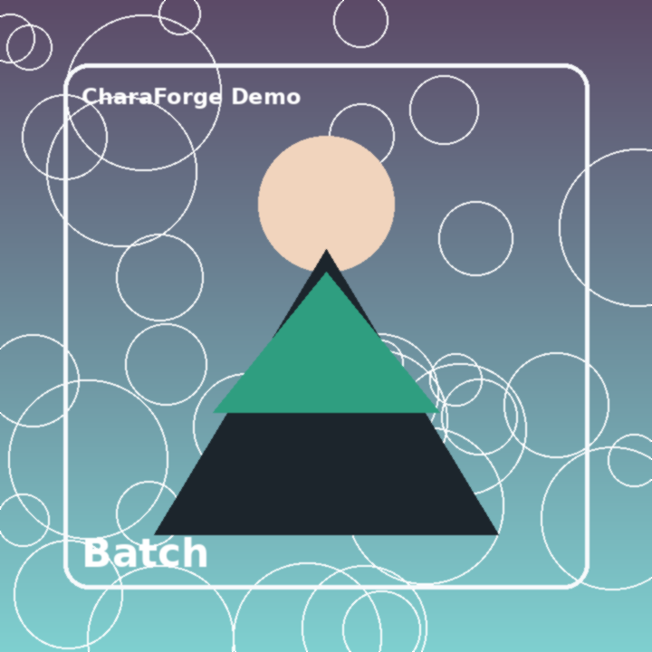
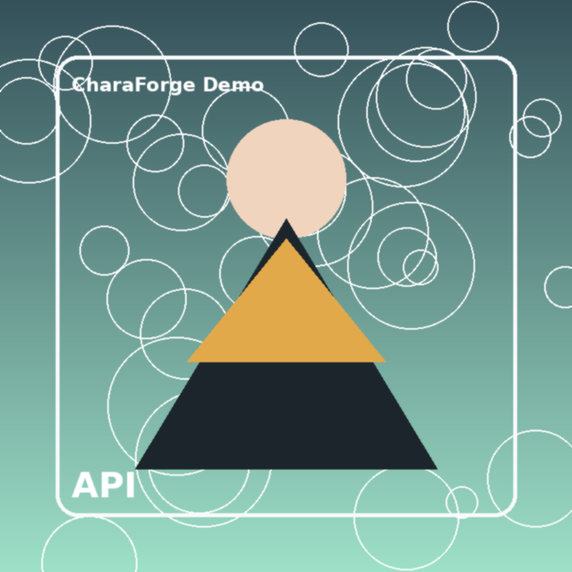
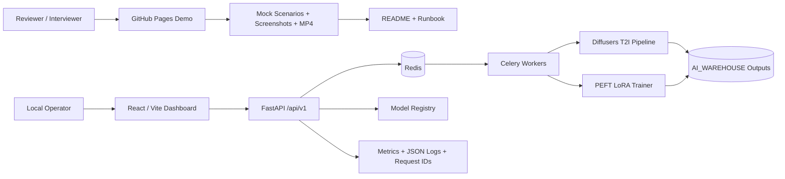
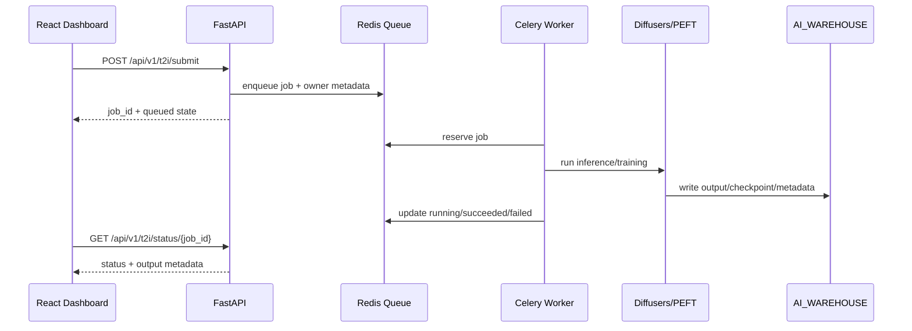
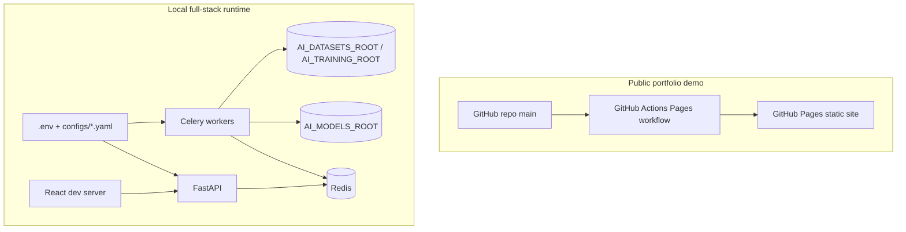

# CharaForge T2I Lab

Portfolio-ready AI image generation and LoRA training lab.

This repository demonstrates how I structure a production-style AI workflow around
text-to-image generation, model registry scanning, async job queues, dataset validation,
LoRA fine-tuning, API security, and a React operator dashboard.

## Live Demo

The public demo is a static GitHub Pages walkthrough:

- Demo site: `https://justin21523.github.io/charaforge-T2I-Lab/`
- Source: [`portfolio-web/`](portfolio-web/)
- Includes: interactive mock scenarios, screenshot gallery, recorded MP4 walkthrough,
  architecture overview, stack notes, and reviewer runbook.
- Recording: [`portfolio-web/assets/demo-walkthrough.mp4`](portfolio-web/assets/demo-walkthrough.mp4)

GitHub Pages cannot run GPU inference, Redis, Celery, or private model weights. The demo
therefore uses mock/recorded states for stable portfolio review while the repo keeps the
real FastAPI backend and worker code for local execution.

## Visual Tour

| Dashboard overview | Text-to-image scenario |
| --- | --- |
|  |  |

| ControlNet flow | LoRA training monitor |
| --- | --- |
|  |  |

| Batch processing | API and job state |
| --- | --- |
|  |  |

## System Flow



## Architecture Table

| Layer | Main files | Responsibility | Demo signal |
| --- | --- | --- | --- |
| Static showcase | `portfolio-web/` | GPU-free portfolio page, screenshots, MP4 walkthrough | Live GitHub Pages review |
| React UI | `frontend/react_app/` | Generation, batch, jobs, LoRA, training, gallery screens | Operator workflow design |
| FastAPI API | `api/` | Versioned routes, auth, rate limits, request IDs, errors | Swagger contract at `/docs` |
| Core AI logic | `core/t2i/`, `core/train/` | Diffusers pipeline, ControlNet hooks, LoRA training helpers | AI libraries wrapped behind app logic |
| Workers | `workers/` | Celery app and long-running task execution | Async GPU job control |
| Config/storage | `configs/`, `core/config.py` | YAML/env settings and AI_WAREHOUSE paths | Reproducible local setup |
| Tests/tooling | `tests/`, `scripts/` | pytest coverage, setup, env checks, smoke scripts | Reviewable engineering hygiene |

## Runtime Job Lifecycle



## Demo Scenarios

| Scenario | What it shows | Reviewer takeaway |
| --- | --- | --- |
| Text-to-image job | Prompt, seed, LoRA stack, timeline, output metadata | The system treats generation as a reproducible job, not a one-off button click. |
| ControlNet guidance | Conditioned generation with pose/depth/canny/lineart style inputs | The API shape is ready for richer image-control workflows. |
| Batch processing | Multi-prompt queue and downloadable outputs | The platform can scale beyond single-image experiments. |
| LoRA training monitor | Dataset validation, loss trend, checkpoint export, progress state | Training is modeled as an observable long-running workflow. |
| API contract | Submit/status/cancel state model and typed payload | UI behavior maps back to a concrete backend contract. |

## API Map

| Capability | Main endpoints | Runtime dependency | Notes |
| --- | --- | --- | --- |
| Health / docs | `GET /api/v1/health`, `/docs` | FastAPI only | First check for local review. |
| Model registry | `GET /api/v1/models`, `POST /api/v1/models/scan` | AI model filesystem | Scans SD1.5, SDXL, ControlNet, LoRA, embeddings. |
| T2I jobs | `POST /api/v1/t2i/submit`, `GET /api/v1/t2i/status/{job_id}` | Redis/Celery or local queue + model weights | Submit/status/cancel pattern. |
| ControlNet | `POST /api/v1/controlnet/{pose|depth|canny|lineart}` | ControlNet weights | Conditioned generation hooks. |
| Batch | `POST /api/v1/batch/submit` | Worker queue | Multi-prompt processing and output packaging. |
| LoRA training | `POST /api/v1/finetune/lora/train` | Redis/Celery + training dataset | Dataset validation, progress, checkpoint export. |
| Datasets | `GET /api/v1/datasets/list` | AI_WAREHOUSE dataset paths | Keeps training inputs outside the repo. |
| Auth / WS | `POST /api/v1/auth/token`, `POST /api/v1/auth/ws_ticket`, `WS /api/v1/ws/train/{job_id}` | API security config | JWT/API key, CSRF, short-lived WebSocket tickets. |

## Deployment View



## What Is Safe To Review Remotely

| Review target | Works on GitHub Pages | Requires local setup |
| --- | --- | --- |
| Product positioning | Yes | No |
| Screenshots and recording | Yes | No |
| Scenario switching / mock job states | Yes | No |
| API source code and tests | GitHub source | Optional |
| Swagger `/docs` | No | Yes, start FastAPI |
| Real GPU inference | No | Yes, model weights + compatible PyTorch stack |
| LoRA training | No | Yes, Redis + Celery + dataset + GPU/CPU memory |

## What To Look For

- FastAPI API surface under `/api/v1` with structured errors, request IDs, auth, rate limits, and CORS.
- Async T2I job handling with queued/running/succeeded/failed/canceled states.
- Redis/Celery training queue with LoRA progress reporting and WebSocket support.
- Model registry scanning for SD1.5, SDXL, ControlNet, LoRA, and embeddings.
- Dataset upload/validation safeguards for fine-tuning workflows.
- React dashboard for generation, ControlNet, batch processing, LoRA management, training monitor, gallery, and jobs.
- Static portfolio packaging with screenshots and a recorded walkthrough that make the project understandable without GPU hardware.

## Current Status

This is a portfolio project, not a hosted public inference service.

Working locally:

- Backend health, auth, dataset, model scan, upload, and job-management code paths.
- React app builds with Vite.
- Static portfolio demo works on GitHub Pages.
- Fast tests cover API health, model scanning, datasets, auth/security, ownership, WebSocket tickets, and observability logic.

Requires local infrastructure:

- Real T2I generation requires compatible PyTorch/Diffusers/PEFT packages, model files or Hugging Face access, and enough CPU/GPU memory.
- Training requires Redis and a Celery worker.
- The default warehouse paths may need to be overridden on machines that cannot write to `/mnt/data`.

## Architecture

```text
React Dashboard / Static Portfolio Demo
        |
        v
FastAPI /api/v1
  - auth, rate limiting, request IDs
  - model registry and dataset validation
  - generation, ControlNet, batch, LoRA, training endpoints
        |
        v
Redis / Celery / worker loops
        |
        v
Diffusers + PEFT + PyTorch
        |
        v
AI_WAREHOUSE storage
  - models
  - datasets
  - cache
  - training runs and generated outputs
```

## Tech Stack

- Frontend: React, Vite, react-router, lucide-react, axios, react-hot-toast.
- Backend: FastAPI, Pydantic settings, httpx tests, structured exception handling.
- AI: PyTorch, Diffusers, Transformers, Accelerate, PEFT, Safetensors.
- Jobs: Redis, Celery, in-process fallback queues for local development.
- Tooling: pytest, pytest-asyncio, ruff, ESLint, Vitest.
- Deployment: GitHub Pages for static demo; Docker Compose for local services.

## Local Setup

Create an environment:

```bash
conda env create -f environment.yml
conda activate ai_env
python scripts/check_ai_env.py
```

If your user cannot write to `/mnt/data`, create a local `.env` override:

```bash
cp .env.example .env
cat >> .env <<'EOF'
AI_DATASETS_ROOT=.local_ai/datasets
AI_TRAINING_ROOT=.local_ai/training
AI_CACHE_ROOT=.local_ai/cache
AI_MODELS_ROOT=.local_ai/models
XDG_CACHE_HOME=.local_ai/cache
HF_HOME=.local_ai/cache/huggingface
TRANSFORMERS_CACHE=.local_ai/cache/huggingface
TORCH_HOME=.local_ai/cache/torch
EOF
```

Then initialize folders:

```bash
python scripts/setup.py
```

## Run The Full Stack Locally

Start Redis:

```bash
docker run -p 6379:6379 --name charaforge-redis -d redis:7
```

Start the API:

```bash
bash scripts/start_api.sh
```

Start workers as needed:

```bash
bash scripts/start_t2i_worker.sh
bash scripts/start_models_scan_worker.sh
bash scripts/start_worker.sh
```

Start the React dashboard:

```bash
npm --prefix frontend/react_app ci
npm --prefix frontend/react_app run dev
```

Useful URLs:

- API docs: `http://localhost:8000/docs`
- Health: `http://localhost:8000/api/v1/health`
- React app: `http://localhost:5173`

## Validation

```bash
ruff check api core workers tests
pytest -q
npm --prefix frontend/react_app ci
npm --prefix frontend/react_app run lint
npm --prefix frontend/react_app run test -- --run
npm --prefix frontend/react_app run build
```

## API Overview

Main routes:

- `GET /api/v1/health`
- `GET /api/v1/models`
- `POST /api/v1/models/scan`
- `POST /api/v1/t2i/submit`
- `GET /api/v1/t2i/status/{job_id}`
- `POST /api/v1/controlnet/{pose|depth|canny|lineart}`
- `POST /api/v1/batch/submit`
- `POST /api/v1/finetune/lora/train`
- `GET /api/v1/datasets/list`
- `POST /api/v1/auth/token`
- `POST /api/v1/auth/ws_ticket`
- `WS /api/v1/ws/train/{job_id}`

See [`docs/api.md`](docs/api.md) for a reviewer-focused API summary.

## Repository Layout

```text
api/                 FastAPI app, routers, auth, job managers
core/                config, model registry, T2I pipeline, training helpers
workers/             Celery app and task implementations
frontend/react_app/  React dashboard
portfolio-web/       GitHub Pages static demo
configs/             model, app, train, celery config
scripts/             setup, startup, smoke, model scan scripts
tests/               pytest coverage for backend behavior
docker/              Dockerfiles and compose configs
docs/                API, deployment, training, and changelog notes
```

## Deployment

Static portfolio demo:

```bash
# Deployed by GitHub Actions from portfolio-web/
```

Local/container full stack:

```bash
docker compose -f docker/docker-compose.yml up --build
```

GitHub Pages is the recommended public demo target for this project because it is reliable,
free, and avoids exposing GPU infrastructure or model files. For a live backend demo, deploy
the API separately to a GPU-capable host or a private workstation behind a reverse proxy.

## Notes For Interviewers

This project is strongest as an engineering portfolio case study. The important parts are the
system boundaries, job state modeling, auth/ownership checks, AI warehouse path discipline,
training progress flow, and the conversion of a local AI tool into a clear portfolio demo.
